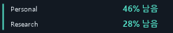
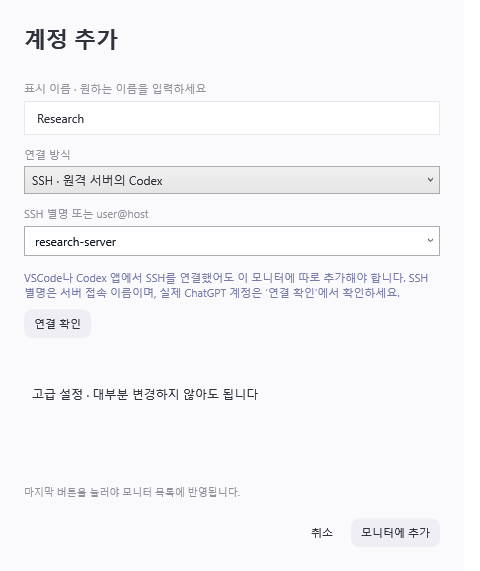
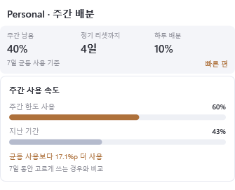
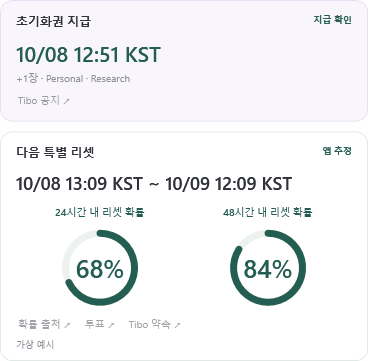
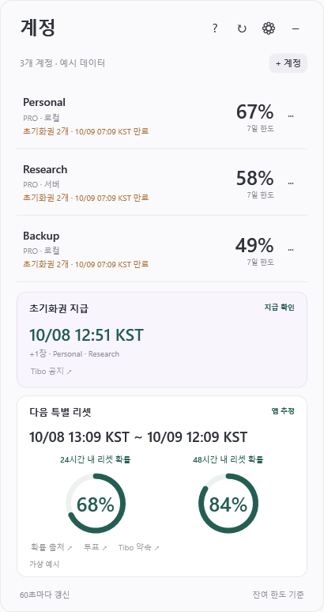

# Codex Account Monitor

**여러 Codex 계정의 남은 한도, 리셋까지의 하루 배분량, 초기화권 지급 시각과 다음 리셋 예상 시각을 한곳에서 확인하는 Windows 프로그램입니다.**

**[⬇ Windows 실행 파일 다운로드](https://github.com/twkim-0501/codex-account-monitor/releases/latest/download/CodexAccountMonitor.exe)** · [릴리스와 ZIP](https://github.com/twkim-0501/codex-account-monitor/releases/latest) · [English](docs/USAGE.en.md)

Windows 10/11 **x64(64비트)** 환경에서 사용합니다. 실행 파일 하나로 동작하며, 모니터를 위해 .NET·Node.js를 따로 설치하거나 소스를 빌드할 필요가 없습니다.

이미 Codex를 쓰고 있다면 **실행 파일 다운로드 → 더블클릭**으로 시작할 수 있습니다. 처음 사용하는 분은 아래 설치 순서부터 따라오세요. 서버 계정 연결은 선택 사항입니다.

## 1. 설치하고 첫 계정 보기

1. **Codex에 로그인합니다.** 이미 이 PC에서 Codex 앱이나 CLI를 쓰고 있다면 다음 단계로 넘어가세요. 처음이라면 [OpenAI의 Windows 데스크톱 앱 안내](https://learn.chatgpt.com/docs/windows/windows-app)를 따라 설치하고, 앱에서 ChatGPT 계정으로 로그인합니다. [Codex CLI](https://learn.chatgpt.com/docs/codex/cli)를 사용해도 됩니다.
2. **[CodexAccountMonitor.exe를 다운로드](https://github.com/twkim-0501/codex-account-monitor/releases/latest/download/CodexAccountMonitor.exe)합니다.** 위 링크는 실행 파일을 바로 받습니다. GitHub의 `Code → Download ZIP`이나 `Source code`를 받을 필요는 없습니다.
3. **계속 사용할 폴더에 파일을 둡니다.** 예를 들어 문서 폴더 안에 `CodexAccountMonitor` 폴더를 만들고 옮깁니다.
4. **파일을 더블클릭하고 첫 조회를 기다립니다.** 별도 설치 창이나 관리자 권한은 필요하지 않습니다. 첫 실행에는 계정 창이 열리고 이 PC의 Codex 로그인 계정을 조회합니다. 계정에 남은 한도 `%`와 상단의 `1개 연결됨`이 표시되면 준비 완료입니다.
5. **`−`를 눌러 접습니다.** 작업표시줄 왼쪽의 작은 위젯에서 계속 확인할 수 있습니다. 위젯을 클릭하면 계정 창이 다시 열립니다.

`로그인이 필요합니다`가 나오면 Codex 앱 또는 CLI에서 로그인을 완료한 뒤 모니터의 `↻`를 누르세요. 브라우저에서 ChatGPT 웹사이트에만 로그인한 상태로는 이 PC의 Codex 로그인이 준비되지 않을 수 있습니다. [공식 로그인 안내](https://learn.chatgpt.com/docs/auth)

작업표시줄 위젯은 이렇게 보입니다. 아래 이미지의 계정과 수치는 가상 예시입니다.

## 2. 다른 계정 추가하기

현재 PC의 기본 계정은 첫 실행에 표시됩니다. 추가 계정은 모니터의 **+ 계정**에서 등록합니다.

### 같은 PC에서 다른 ChatGPT 계정

1. **+ 계정**을 누르고 구별하기 쉬운 표시 이름을 입력합니다.
2. 연결 방식에서 **로컬 · 별도 계정으로 로그인**을 선택합니다.
3. **이 계정으로 로그인**을 누르고, 열린 브라우저에서 추가할 ChatGPT 계정으로 로그인합니다.
4. 모니터로 돌아와 **연결 확인**을 누릅니다. 표시된 이메일과 플랜이 맞으면 **모니터에 추가**를 누릅니다.

마지막 **모니터에 추가**까지 눌러야 목록에 나타납니다. 별도 로그인 프로필을 사용하므로 기존 Codex 로그인은 유지됩니다.

<strong>SSH 서버의 계정 연결하기 · 서버를 사용할 때만</strong>

서버에 bash와 Codex가 설치되어 있고, 원하는 ChatGPT 계정으로 로그인되어 있어야 합니다. Windows에서 비밀번호 입력 없이 SSH 키로 접속할 수 있어야 합니다. 처음 설정한다면 [SSH 준비 안내](docs/SSH-SETUP.md)를 먼저 확인하세요.

1. Windows PowerShell에서 `ssh research-server`를 실행해 접속을 확인합니다. `research-server`는 본인의 SSH 별명으로 바꿉니다. 서버 터미널이 열리면 접속된 것입니다.
2. 접속한 서버 터미널에서 `codex --version`과 `codex login status`를 확인합니다. 확인 후 `exit`로 돌아옵니다.
3. 모니터의 **+ 계정**에서 표시 이름을 입력하고 **SSH · 원격 서버의 Codex**를 선택합니다.
4. SSH 별명을 선택하거나 `user@host`를 입력합니다.
5. **연결 확인**에서 의도한 이메일과 플랜인지 확인합니다.
6. **모니터에 추가**를 누릅니다.

VSCode나 Codex 앱에 서버를 연결했어도 **이 모니터에는 별도로 추가**해야 합니다. SSH 별명과 표시 이름은 ChatGPT 계정을 바꾸지 않습니다. 서버에 현재 로그인된 계정의 사용량이 나옵니다.

프로젝트 폴더는 입력하지 않습니다. 고급 설정의 `CODEX_HOME`은 프로젝트가 아닌 **Codex 로그인 프로필 폴더**입니다. 기본 프로필이라면 비워두세요.

## 3. 화면 읽는 법

**계정 옆의 %는 남은 사용 한도입니다. 리셋 카드의 %는 리셋이 일어날 예상 확률입니다.** 같은 % 표시지만 뜻이 다릅니다.

| 화면 | 의미 |
| --- | --- |
| 계정 옆의 큰 **%** | 여러 한도 중 가장 적게 남은 한도입니다. 바로 아래의 `5시간 한도` 또는 `7일 한도`로 구분합니다. 계정을 클릭하면 사용 속도와 상세 정보를 펼칩니다. |
| **주간 남음 / 정기 리셋까지 / 하루 배분** | 주간 잔여 한도를 남은 일수로 나눈 값입니다. 40%가 남고 리셋까지 4일이면 하루에 전체 주간 한도의 10%씩 쓰는 기준입니다. |
| **빠른 편 / 적정 속도 / 여유 있음** | 7일 동안 고르게 쓰는 경우와 비교한 상태입니다. 계정을 펼치면 한도 사용 비율과 지난 기간을 막대로 비교합니다. |
| **초기화권** | 보유 개수와 제공된 만료일을 표시합니다. 모니터가 초기화권을 사용하지는 않습니다. |
| **초기화권 지급** | 언제 지급될지 크게 표시합니다. 이미 받았다면 실제 확인 시각, 새로 받은 개수, 확인된 계정을 표시합니다. `+1장`은 현재 보유 개수가 아니라 이번에 새로 받은 개수입니다. |
| **다음 특별 리셋**의 두 게이지 | 24시간·48시간 안에 리셋이 일어날 것으로 예상하는 확률입니다. [CodexReset](https://codexreset.org/)에서 가져오며 실제 리셋을 보장하지는 않습니다. |
| **다음 특별 리셋**의 큰 시각 | 다음 리셋의 예상 시각이나 시간 범위입니다. Tibo가 직접 예고한 일정과 앱이 예상한 시간은 오른쪽 상태로 구분합니다. |
| **카드 아래 링크** | `Tibo 공지`, `투표`, `Tibo 약속`은 해당 글을 엽니다. `확률 출처`는 확률을 제공하는 사이트를 엽니다. 앱 안에는 긴 설명을 표시하지 않습니다. |
| **이전 / —** | 이전은 마지막 성공 조회값이고, —는 아직 알 수 없는 값입니다. 0%라는 뜻이 아닙니다. |

아래 주간 배분 화면은 **가상 계정과 가상 수치**입니다. 7일 중 3일이 지나고 한도는 60%를 썼습니다. 균등하게 썼을 때의 43%보다 약 17%p 많이 쓴 상태입니다. `%p`는 두 비율의 차이를 뜻합니다.

하루 배분은 추가 사용 제한이 아니라 남은 한도를 고르게 쓰기 위한 기준입니다. 정확한 남은 토큰 수를 뜻하지 않습니다. **각 계정의 정기 리셋 시각**으로 계산하며, 특별 리셋 예상 시각은 포함하지 않습니다. 리셋이나 초기화권 사용 뒤에는 새 조회값으로 다시 계산합니다. 하루 미만이 남으면 `리셋까지 배분`으로 남은 한도 전체를 표시합니다. 조회 실패, 10분 넘게 갱신되지 않은 값, 리셋 시각 미제공은 `확인 필요`로 표시합니다.

아래는 지급·리셋 카드의 예시입니다. **계정, 날짜, 확률은 모두 가상 데이터**입니다. 카드에 적힌 `KST`는 한국시간입니다.

| 카드의 상태 | 이렇게 읽으세요 |
| --- | --- |
| **지급 확인** | 표시된 계정에서 새 초기화권을 확인했습니다. 큰 시각은 지급을 확인한 시각입니다. |
| **지급 예고 / 지급 진행 중** | 초기화권 지급이 예고됐거나 진행 중입니다. 큰 시각은 예상 시각이며, 모든 계정에 지급됐다는 뜻은 아닙니다. |
| **직접 예고** | Tibo가 진행하겠다고 알린 일정입니다. 실제 완료 여부는 이후 소식으로 확인합니다. |
| **앱 추정** | 앱이 투표와 약속을 참고해 예상한 시간입니다. 확정된 일정은 아닙니다. |
| **다음 리셋 시각 미정** | 언제 리셋될지 정할 정보가 아직 없습니다. 확률만 확인되는 경우도 있습니다. |
| **예정 시각 지남 · 완료 확인 중** | 예고한 시간은 지났지만 완료를 아직 확인하지 못했습니다. 시간이 지났다는 이유만으로 완료 처리하지 않습니다. |

**완료된 예고는 어떻게 되나요?** 초기화권을 받은 것이 확인되면 지급 예정 시각을 실제 확인 시각으로 바꿉니다. 리셋 완료가 확인되면 그 전에 나온 일회성 예고와 이전 확률을 만료시킵니다. 새 확률이 나올 때까지 게이지는 `—`로 표시합니다. 별도로 예정된 다음 리셋은 유지합니다.

<strong>전체 계정 창도 보기 · 가상 데이터</strong>

위젯에는 앞의 3개 계정이 보입니다. 더 많으면 **+N**을 눌러 전체 목록을 엽니다. 한 계정에 여러 한도가 있으면 위젯은 가장 낮은 잔여 비율을 표시합니다.

계정은 기본 **60초**, 공개 리셋 소식은 **10분**마다 갱신합니다. `⚙`에서 갱신 간격, 알림, Windows 로그인 시 자동 시작을 바꿀 수 있습니다. 자동 시작은 처음에는 꺼져 있습니다.

`−`와 창 닫기는 상세 창을 접습니다. 앱을 완전히 종료하려면 **위젯 또는 오른쪽 아래 알림 영역 아이콘을 우클릭 → 종료**를 선택합니다.

## 4. 잘 안될 때

| 상황 | 해결 방법 |
| --- | --- |
| 실행했는데 창이나 위젯이 안 보여요 | 오른쪽 아래 알림 영역의 숨겨진 아이콘 `^`를 확인합니다. 모니터 아이콘을 클릭하면 계정 창이 열립니다. 우클릭 → **왼쪽 미니 위젯 표시**로 위젯을 켤 수 있습니다. |
| 로그인이 필요하다고 나와요 | 이 PC의 Codex 앱 또는 CLI에 ChatGPT 계정으로 로그인한 뒤 `↻`를 누릅니다. |
| Codex 실행파일을 찾지 못해요 | Codex 앱 또는 CLI가 이 PC에 설치되어 있는지 확인하고 모니터를 다시 실행합니다. 설치했는데도 실패하면 [실행파일 경로 안내](docs/DEVELOPMENT.md#codex-실행파일-경로)를 확인하세요. |
| 추가한 계정이 목록에 없어요 | 브라우저 로그인이나 **연결 확인** 뒤에 **모니터에 추가**까지 눌렀는지 확인합니다. |
| SSH 조회가 실패하거나 다른 계정이 나와요 | [SSH 연결 문제 해결](docs/SSH-SETUP.md)을 확인합니다. 서버 접속 사용자와 Codex 로그인 계정이 맞는지 점검합니다. |
| 다음 리셋 시각이 미정이라고 나와요 | 아직 구체적인 일정이나 시간을 예상할 정보가 부족합니다. 근거 링크에서 소식을 확인할 수 있습니다. 새 예고가 나오면 다음 조회 때 갱신합니다. |
| 리셋 확률에 —가 나와요 | 확률을 확인하지 못했거나 값이 오래된 상태입니다. 최근 리셋이 끝나서 이전 확률을 만료시킨 경우에도 표시됩니다. 앱을 켜두면 다시 조회합니다. |
| 알림을 줄이고 싶어요 | `⚙`에서 리셋 알림, 투표·힌트 알림, 초기화권 만료 알림을 필요에 맞게 끕니다. |
| Windows 실행 경고가 떠요 | 현재 파일에는 코드 서명이 없습니다. 이 저장소의 릴리스에서 받은 파일인지 확인하세요. [파일 확인 방법](docs/DEVELOPMENT.md#다운로드한-파일-확인)에 체크섬 비교 방법이 있습니다. |

Free 계정도 제외하지 않습니다. 제공되는 한도와 토큰 지표는 계정·Codex 버전에 따라 다릅니다. 작업표시줄 내부 표시는 Windows 11 가운데 정렬을 대상으로 하며, 다른 배치에서는 작업표시줄 바로 위에 표시합니다.

## 5. 업데이트와 삭제

업데이트할 때는 다시 계정을 등록할 필요가 없습니다.

1. 위젯 또는 알림 영역 아이콘을 **우클릭 → 종료**합니다. 창의 `×`만 누르면 앱은 계속 실행 중입니다.
2. **[새 실행 파일을 다운로드](https://github.com/twkim-0501/codex-account-monitor/releases/latest/download/CodexAccountMonitor.exe)**합니다.
3. 기존 `CodexAccountMonitor.exe`를 새 파일로 교체합니다. 같은 폴더와 파일 이름을 쓰면 자동 시작 경로도 유지됩니다.
4. 새 파일을 더블클릭합니다. 계정 연결과 설정은 별도로 저장되어 그대로 유지됩니다.

**삭제:** `⚙`에서 자동 시작을 끄고 앱을 종료한 뒤 실행 파일을 삭제합니다. 저장된 연결까지 지우려면 [설정과 로그인 프로필 안내](docs/DEVELOPMENT.md#설정과-로그인-프로필)를 확인하세요.

문제가 남으면 [GitHub Issues](https://github.com/twkim-0501/codex-account-monitor/issues)에 Windows 버전, 앱 버전, 표시된 안내 문구를 남겨주세요. 스크린샷의 이메일·서버 주소는 가리고, 인증 파일·키·토큰은 첨부하지 마세요.

## 자세한 안내와 출처

[SSH 설정](docs/SSH-SETUP.md) · [리셋 예측의 판단 기준](docs/RESET-MONITOR.md) · [빌드·설정·개인정보 안내](docs/DEVELOPMENT.md) · [변경 기록](CHANGELOG.md)

[Codex Pulse](https://github.com/pjhun0412/codex-pulse)의 위젯 아이디어와 UI를 참고하고, OpenAI Codex를 사용해 다중 계정·SSH 모니터링 용도로 개조·확장했습니다. 코드는 C#/WPF로 재작성했습니다. [전체 크레딧과 기술 출처](docs/CREDITS.md)

구현 코드는 [MIT License](LICENSE)입니다. OpenAI나 원작자의 공식 프로그램은 아닙니다.
