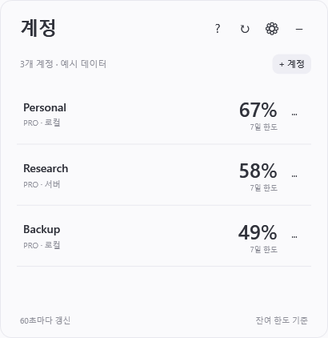
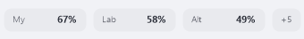

# Codex Account Monitor

> 기존 **[Codex Pulse](https://github.com/pjhun0412/codex-pulse)**를 참고하여 **OpenAI Codex로 다중 계정·SSH 서버 모니터링 용도에 맞게 개조·확장한 개인용 프로그램**입니다. 원작의 위젯 아이디어와 사용 방식에 대한 크레딧은 **[pjhun0412](https://github.com/pjhun0412)**에게 있습니다. 코드는 C#/WPF로 재작성했고, v1.2의 미니 위젯과 상세 목록은 새로 디자인했습니다. 자세한 출처와 제작 방식은 아래에 명시했습니다.

여러 Codex 계정의 **남은 사용 한도와 토큰 사용량**을 한 곳에서 확인하는 Windows 프로그램입니다. 현재 PC의 계정, 별도 로컬 계정, SSH 서버에 로그인된 계정을 연결할 수 있습니다.

**[Windows 실행 파일 다운로드](https://github.com/twkim-0501/codex-account-monitor/releases/latest)** · [SSH 설정 안내](docs/SSH-SETUP.md) · [English guide](docs/USAGE.en.md) · [변경 기록](CHANGELOG.md)

일반 사용자는 소스 코드나 .NET SDK를 설치할 필요가 없습니다. 릴리스의 `CodexAccountMonitor.exe` 하나로 실행할 수 있습니다. Codex 앱 또는 CLI와 계정 로그인은 별도로 필요합니다.

An adaptation and extension of the Codex Pulse widget concept, developed using OpenAI Codex for personal multi-account and SSH monitoring. Original concept/workflow reference: **[pjhun0412/codex-pulse](https://github.com/pjhun0412/codex-pulse)**. The implementation was rewritten in C#/WPF; the v1.2 interface was redesigned with translucent taskbar chips and a light expandable account list.




Four or more connections keep the same single row; an overflow button opens the full list. Example with eight fictional accounts:



## 시작하기

| 준비물 | 설명 |
| --- | --- |
| Windows 10/11 x64 | 작업표시줄 내부 표시는 Windows 11 가운데 정렬을 대상으로 합니다. 다른 배치에서는 바로 위에 표시합니다. |
| Codex 앱 또는 Codex CLI | [공식 시작 안내](https://learn.chatgpt.com/docs/quickstart)를 따라 설치하고 로그인합니다. |
| SSH 서버 · 서버를 연결할 때만 | 서버에 bash와 Codex가 설치돼 있고, Windows에서 SSH 키 인증으로 접속할 수 있어야 합니다. Linux 서버에서 확인했습니다. |

1. [최신 릴리스](https://github.com/twkim-0501/codex-account-monitor/releases/latest)의 **Assets**에서 `CodexAccountMonitor.exe`를 다운로드합니다. `Source code`는 개발자용입니다. 문서도 함께 보관하려면 ZIP을 내려받아 압축을 풉니다.
2. 원하는 폴더에 실행 파일을 두고 실행합니다. 별도 설치 과정이나 관리자 권한은 필요하지 않습니다.
3. 첫 실행에는 상세 창이 열리고 **이 PC의 현재 Codex 로그인 계정**을 조회합니다. `로그인이 필요합니다`가 나오면 Codex 앱 또는 CLI에서 먼저 로그인하고 `↻`를 누릅니다.
4. 다른 계정은 아래 방법으로 **직접 추가**합니다. 상세 창의 `?` 버튼에서도 사용 방법을 볼 수 있습니다.
5. `−`를 눌러 접으면 왼쪽 아래 미니 위젯으로 계속 확인할 수 있습니다.

미니 위젯이 보이지 않을 때는 **오른쪽 아래 알림 영역**의 아이콘을 확인하세요. 숨겨진 아이콘 메뉴 `^` 안에 있을 수도 있습니다. 우클릭 → **왼쪽 미니 위젯 표시**로 다시 켤 수 있습니다.

## 다른 계정 연결하기

> **VSCode 또는 Codex 앱의 SSH 연결과 이 모니터의 등록은 별개입니다.** 서버 계정 생성·SSH 연결·Codex 로그인을 완료했어도 모니터의 **+ 계정 → 모니터에 추가**까지 진행해야 표시됩니다. SSH 설정은 선택할 후보를 제공할 뿐 자동 등록하지 않습니다.

| 원하는 연결 | 선택할 연결 방식 | 마지막 단계 |
| --- | --- | --- |
| 이 PC의 기존 Codex 로그인 | 로컬 · 현재 Codex 로그인 | 연결 확인 → 모니터에 추가 |
| 이 PC에서 다른 ChatGPT 계정 | 로컬 · 별도 계정으로 로그인 | 브라우저 로그인 → 연결 확인 → 모니터에 추가 |
| 서버에 이미 로그인된 계정 | SSH · 원격 서버의 Codex | SSH 별명 선택 → 연결 확인 → 모니터에 추가 |

### SSH 서버의 계정

1. 상세 창에서 **+ 계정**을 누릅니다.
2. 표시 이름을 입력합니다. `Research`처럼 구별하기 쉬운 이름이면 됩니다.
3. 연결 방식에서 **SSH · 원격 서버의 Codex**를 선택합니다.
4. SSH 별명(예: `research-server`)을 선택하거나 `user@host`를 입력합니다.
5. **연결 확인**을 눌러 이메일과 플랜이 의도한 계정인지 확인합니다. 모델 작업을 시작하지 않고 계정·사용량만 조회합니다.
6. **모니터에 추가**를 누릅니다. 창이 닫히고 목록에 나타나면 등록 완료입니다.


**SSH 별명, 서버의 Linux 사용자 이름, ChatGPT 계정은 서로 다릅니다.** 별명이 `research-server`여도 서버의 Codex가 개인 계정에 로그인돼 있으면 개인 계정의 사용량이 나옵니다. 표시 이름만 바꿔도 로그인 계정은 바뀌지 않습니다. 잘못된 계정이 조회되면 먼저 해당 서버의 Codex 로그인 프로필을 확인하세요. 여러 계정을 함께 쓸 때는 로그인 프로필 또는 서버 사용자를 구분해야 합니다.

이 모니터에는 작업할 프로젝트 폴더를 추가할 필요가 없습니다. `/home/user/project`는 프로젝트 경로이고, 고급 설정의 `CODEX_HOME`은 **Codex 로그인 프로필 경로**입니다. 기본 프로필을 쓴다면 비워두세요. 자세한 준비·확인 명령은 [SSH 설정 안내](docs/SSH-SETUP.md)에 있습니다.

### 이 PC에서 별도의 계정

**+ 계정 → 로컬 · 별도 계정으로 로그인**에서 표시 이름을 입력하고 **이 계정으로 로그인**을 누릅니다. 브라우저에서 원하는 계정으로 로그인한 뒤 **연결 확인 → 모니터에 추가**까지 진행하세요. 브라우저 로그인만 완료한 상태는 모니터 등록 완료가 아닙니다.

현재 Codex 로그인과 다른 프로필을 만들어 사용하므로 기존 로그인은 유지됩니다. 새 프로필은 Windows 자격 증명 저장소를 사용합니다. 생성된 프로필은 이 모니터의 조회용이며, 다른 Codex 앱의 계정 목록을 자동으로 변경하지 않습니다.

각 계정의 `···`에서 이름과 연결을 편집하거나 제거할 수 있습니다. **연결 삭제**는 모니터 목록에서만 제거하며 서버 파일이나 Codex 인증 정보를 삭제하지 않습니다.

## 평소 사용하기

상세 창은 미니 위젯 바로 위에 열리며 **내용에 맞춰 높이를 자동으로 조절**합니다. 계정을 펼치거나 접을 때, 새로고침으로 내용이 바뀔 때, 창 너비를 바꿀 때도 높이를 맞춥니다. 창을 작게 줄였더라도 다시 열면 내용에 맞게 복구합니다. **화면에서 사용할 수 있는 높이를 넘을 때만 스크롤**이 생깁니다. 드래그와 너비 조절도 가능합니다.

`−`와 창 닫기는 상세 창을 접습니다. 오른쪽 아래 알림 영역 아이콘으로도 상세 창을 열고 접을 수 있습니다. 미니 위젯이나 알림 영역 아이콘을 우클릭하면 메뉴가 열리며, 완전히 종료하려면 **종료**를 선택합니다.

설정에서 갱신 간격(기본 60초), 상세 창을 항상 위에 표시, 잔여 한도 10% 이하 알림, 미니 위젯 표시·도킹, Windows 로그인 시 접힌 상태로 시작을 변경할 수 있습니다. 자동 시작은 기본적으로 꺼져 있습니다. 미니 위젯만 숨겼을 때는 알림 영역 우클릭 → **왼쪽 미니 위젯 표시**로 복구할 수 있습니다.

미니 위젯은 **앞의 3개 연결을 여백 있는 한 줄**로 표시합니다. 검은 바탕을 그리지 않고 작업표시줄 배경이 비치며, 시스템의 밝은/어두운 테마에 맞게 글자색을 바꿉니다. 2개일 때는 폭이 줄고, 3개는 모두 표시하며, 4개부터는 **`+N` 버튼**을 붙입니다. 예를 들어 8개 연결이면 3개와 `+5`가 표시됩니다. 미니 위젯의 최대 폭은 340 논리 픽셀이며 계정 수에 따라 계속 넓어지지 않습니다. `+N`을 클릭하면 전체 목록이 열리고, 화면 높이를 넘는 경우 스크롤할 수 있습니다.

계정에 한도 창이 여러 개 있으면 그중 가장 낮은 **잔여 비율**을 표시합니다. 이전 조회값에는 `이전`, 조회할 수 없는 값에는 `—`, 사용 제한에는 `제한`을 표시합니다. 계정 편집의 **작업표시줄 이름**으로 최대 6글자의 짧은 이름을 지정할 수 있습니다. 비워두면 이름을 줄여 표시하며 끝의 계정 번호는 유지합니다(`research02` → `rese02`).

상세 창은 밝은 접이식 목록입니다. 전체 계정과 잔여 비율을 먼저 보여주고, **계정을 클릭하면 초기화 시각, 모든 한도 창, 일별·누적 토큰, 추이, 리셋 횟수**를 펼칩니다. 펼친 상태는 자동 갱신 뒤에도 유지됩니다. 기존 연결 설정은 업그레이드 뒤에도 유지됩니다.

연결 순서가 표시 순서입니다. 최대 50개 연결을 등록할 수 있고, 동시에 조회하는 연결은 최대 3개입니다. 새 연결은 목록 끝에 추가됩니다.

작업표시줄 내부 도킹은 **Windows 11의 가운데 정렬된 가로 작업표시줄**을 대상으로 합니다. Windows 10, 왼쪽 정렬, 세로 작업표시줄 또는 도킹 실패 시에는 시작·검색 버튼을 가리지 않도록 작업표시줄 바로 위에 표시합니다. 설정에서 도킹을 해제하면 이 배치를 직접 선택할 수도 있습니다. Explorer 내부 창 구조는 공식 확장 API가 아니므로 Windows 업데이트에 따라 달라질 수 있습니다. 도킹된 미니 위젯에는 항상 위에 표시를 강제하지 않으며 작업표시줄의 숨김 상태를 따릅니다. 작업표시줄 바로 위 모드는 다른 일반 창 위에 표시하고, 다른 앱의 전경 창이 모니터 전체를 덮으면 숨김을 시도합니다. Explorer가 다시 시작돼 창이 사라지면 재연결을 시도합니다.

## 자주 묻는 질문 · 문제 해결

| 상황 | 확인할 것 |
| --- | --- |
| VSCode에서 로그인한 계정이 안 보여요 | 모니터에서 **+ 계정 → SSH → 연결 확인 → 모니터에 추가**를 완료했는지 확인합니다. VSCode 로그인은 자동 등록되지 않습니다. |
| SSH 별명이 목록에 없어요 | `%USERPROFILE%\.ssh\config`의 `Host`를 확인합니다. 직접 별명이나 `user@host`를 입력할 수도 있습니다. 설정을 바꿨다면 계정 추가 창을 다시 엽니다. |
| 다른 이메일이 나와요 | 해당 SSH 별명으로 접속하는 서버 사용자와 Codex 로그인 프로필을 확인합니다. SSH 별명이나 표시 이름은 ChatGPT 계정 식별자가 아닙니다. |
| Free라서 안 보이는 건가요? | 이 앱은 Free 계정을 제외하지 않습니다. 실제 Free 계정의 로그인·한도·토큰 조회를 확인했습니다. 제공되는 지표와 이용 권한은 계정과 Codex 버전에 따라 달라집니다. [공식 플랜 안내](https://learn.chatgpt.com/docs/pricing)도 확인하세요. |
| 한도 기간이 7일이 아니라 30일이에요 | 서버가 제공한 기간을 그대로 표시합니다. Free 계정에서 30일 창을 확인했지만 모든 계정에 같은 기간을 가정하지 않습니다. |
| `—` 또는 한도 미제공이 나와요 | 조회 전이거나 Codex가 해당 지표를 제공하지 않는 상태입니다. 0%를 의미하지 않습니다. 계정을 펼쳐 안내를 확인합니다. |
| `이전`이 표시돼요 | 마지막 성공 값을 보여주는 중입니다. 네트워크·SSH·로그인을 확인한 뒤 `↻`를 누릅니다. |
| SSH 연결 확인이 실패해요 | 터미널에서 `ssh research-server`를 실행해 최초 호스트 키 확인과 키 인증을 마칩니다. 서버의 `codex --version`과 `codex login status`도 확인합니다. |
| 서버의 Codex를 찾지 못해요 | 서버 로그인 셸의 PATH를 확인하거나 고급 설정의 **Codex 실행파일**에 서버의 실제 실행파일 절대 경로를 입력합니다. |
| 창을 닫아도 앱이 남아요 | 창 닫기는 접기입니다. 완전 종료는 미니 위젯 또는 알림 영역 우클릭 → **종료**입니다. |
| 상세 창에 스크롤이 생겨요 | v1.3.1부터 내용에 맞춰 자동으로 높이를 조절합니다. 모두 펼친 내용이 화면 높이를 넘는 경우에는 스크롤이 필요합니다. 이전 버전이면 최신 릴리스로 업데이트하세요. |
| 실행 파일이 차단되거나 경고가 떠요 | 현재 릴리스에는 코드 서명이 없습니다. 이 저장소 릴리스에서 받은 파일인지 확인하고 `SHA256SUMS.txt`와 해시를 비교할 수 있습니다. |

## 업데이트와 삭제

업데이트할 때는 미니 위젯 또는 알림 영역 우클릭 → **종료**로 앱을 끝낸 뒤, 실행 파일을 새 릴리스 파일로 교체합니다. 같은 경로에 두면 자동 시작 설정을 유지하기 쉽습니다. 연결과 설정은 `%LOCALAPPDATA%\CodexAccountMonitor`에 별도로 저장되어 실행 파일을 바꿔도 유지됩니다.

삭제하려면 설정에서 **Windows 로그인 시 접힌 상태로 시작**을 끄고 앱을 종료한 뒤 실행 파일을 삭제합니다. 설정 폴더를 삭제하면 저장된 연결과 `profiles`의 별도 로그인 프로필도 제거됩니다. Windows 자격 증명 저장소의 항목은 별도로 남을 수 있습니다. 기본 Codex 프로필과 원격 서버는 변경하지 않습니다.

도움이 필요하면 [GitHub Issues](https://github.com/twkim-0501/codex-account-monitor/issues)에 Windows 버전, 앱 버전, 연결 방식, 표시된 안내 문구를 알려주세요. 스크린샷에는 이메일·서버 주소를 가려주세요. 인증 파일, 키, 토큰은 첨부하지 마세요.

## What it shows

- Every quota bucket/window actually returned by Codex: remaining percentage, window duration, and reset time. No hardcoded five-hour/seven-day assumptions.
- Account plan, masked email, and local/SSH connection name.
- Latest returned daily token bucket, lifetime tokens, and recent daily trend.
- Earned reset-credit count when provided. The app only displays these credits; it does not consume them.
- Last successful update and explicit stale/error states. Missing metrics remain unknown rather than zero.
- A duplicate-account notice when the backend supplies enough identity information. No account-wide percentages or totals are added together.

The displayed daily date is the server's bucket date, **not a guaranteed midnight-to-midnight total in your local timezone**. Quota percentage and token activity are separate metrics; the app does not estimate an exact remaining token count or actual subscription spending.

## Architecture and credentials

Each connection uses `codex app-server --listen stdio://` and JSON-RPC:

```text
Local Codex / isolated local profile ── stdio ──┐
Remote Codex ── SSH (existing key) ── stdio ────┼── local cache ── Win32 mini widget
Additional accounts ──────────────────────────┘             └── WPF details
```

- Queries: `account/read`, `account/rateLimits/read`, and `account/usage/read`.
- Only explicitly initiated isolated-profile login uses `account/login/start`/`cancel`.
- No turns are started, no chats are read, and no AI tokens are spent on monitoring.
- Remote credentials stay on the remote host. No public listening port or remote collector installation is needed. A small app-server process is started through SSH and ended when the monitor closes.
- The app does not read, copy, display, or log `auth.json`, access tokens, refresh tokens, SSH private keys, or raw server diagnostics.
- Up to three sources refresh concurrently. Account services can still throttle reads; increase the refresh interval if needed.

Settings and cached **usage metadata** are local files under `%LOCALAPPDATA%\CodexAccountMonitor`. They contain connection names/paths, email/account identity, percentages, token counts, and update times. They are not encrypted. They never contain login tokens. Do not publish these files or screenshots of your real accounts.

New local login profiles live under `%LOCALAPPDATA%\CodexAccountMonitor\profiles`. Codex owns credential storage and renewal. Existing sessions can expire or be revoked; reconnect/login in the corresponding Codex environment if that happens.

Codex's app-server protocol can change. Tested with local CLI `0.160.0` and remote CLI `0.159.2`; unsupported metrics are shown explicitly. ChatGPT-backed Codex accounts are the intended target. API-key/Bedrock accounts may not provide these subscription metrics.

## Configuration

The UI writes `settings.json` outside this repository. See [settings.example.json](docs/settings.example.json) for a generic example. For SSH, `codexPath` may be an absolute native binary path and `codexHome` must be an absolute remote directory. Empty values use the remote login shell's `codex` and its default profile.

Local Codex is discovered in the desktop app's bundled binaries, native `codex.exe` on PATH, or npm's native binaries. You can also select a native executable path. `.cmd`/`.ps1` launchers are not accepted.

<details>
<summary>개발자용 · 소스 빌드와 검증</summary>

## Build and verify

Requires the .NET 10 SDK on Windows. No third-party NuGet packages are used.

```powershell
dotnet build src/CodexAccountMonitor/CodexAccountMonitor.csproj -c Release
dotnet run --project tests/CodexAccountMonitor.Tests -c Release
dotnet publish src/CodexAccountMonitor/CodexAccountMonitor.csproj -c Release -r win-x64 --self-contained true -o dist
```

Read-only live check (does not start model turns):

```powershell
dotnet run --project tests/CodexAccountMonitor.Tests -c Release -- --live local research-server
```

UI preview and layout verification:

```powershell
.\dist\CodexAccountMonitor.exe --demo
.\dist\CodexAccountMonitor.exe --demo --screenshot C:\Temp\monitor-preview.png
# Native widget check on an interactive Windows desktop:
.\dist\CodexAccountMonitor.exe --demo --widget-check C:\Temp\monitor-widget-check
.\dist\CodexAccountMonitor.exe --demo --demo-accounts 8 --widget-check C:\Temp\monitor-overflow-check
# Content sizing checks with fictional accounts; no interactive taskbar required:
.\dist\CodexAccountMonitor.exe --layout-check C:\Temp\monitor-layout-check
.\dist\CodexAccountMonitor.exe --demo-accounts 8 --layout-check C:\Temp\monitor-layout-eight
```

`--open` opens the detail panel immediately; normal launch starts with the mini widget. `--demo-accounts 1..12` selects the number of fictional demo connections (default: 3). `--settings <absolute-path>` loads an alternative settings file for controlled checks. `--live-screenshot <absolute-path>` queries configured accounts, saves the rendered details plus light/dark mini previews, and exits. **Live screenshots are private data and should not be committed.** Demo/screenshot modes do not save connection changes or enable startup registration.

The deterministic checks cover multiple quota buckets, nullable data, account/workspace identity, invalid timestamps, backend-blocked states, safe SSH command construction, out-of-order JSON-RPC responses, RPC errors, and cancellation. `--layout-check` uses only fictional accounts and verifies expand/collapse, refresh with an unchanged account count, reopen after manual shortening, wrapped text at narrow widths, and overflow in a constrained viewport. CI runs those checks with three and eight accounts, builds the widget, and renders demo previews. Version tags build a self-contained executable and publish a GitHub release.

The local native-widget check compares visible text pixels with the rendered surface and verifies pointer hit testing, menu/detail handlers, collapse/close behavior, overlay mode, the three-account width bound, full-list overflow, expanded-row persistence across refresh, and content-sized panel height. Live mode also checks the account-connection form's identity result and missing-SSH-target guidance. It records parent/style diagnostics, panel/viewport measurements, and cropped widget images. Test clicks send messages only to this process's own widget; they do not inject physical mouse input. Verified on the development PC: an actual Explorer child, no topmost style when docked, an 8-account demo (17 checks), three real local/SSH accounts including Free (18 checks), 12 layout checks each with three/eight fictional accounts, and 17 parser/transport checks. All three real accounts expanded without scrolling on the development display; eight fully expanded demo accounts used scrolling at the screen limit. Physical mouse use, Explorer restart, full-screen applications, and multiple-monitor/DPI changes still need separate manual verification. CI renders 3- and 8-account previews including the fictional SSH registration form without requiring an interactive Explorer taskbar.

</details>

## 출처와 제작 방식 · Credits

- **원작 및 UI·사용 방식 참고:** [Codex Pulse — pjhun0412/codex-pulse](https://github.com/pjhun0412/codex-pulse). Windows 작업표시줄에서 Codex 사용량과 시스템 상태를 확인하는 원작 위젯과, 사용자가 제공한 해당 프로그램의 스크린샷을 참고했습니다. 원본의 프로그램 이름, 버전 `0.1.0`, 식별자 `com.codexpulse.widget`는 [원본 설정 파일](https://github.com/pjhun0412/codex-pulse/blob/main/src-tauri/tauri.conf.json)에서 확인할 수 있습니다.
- **개발 도구:** OpenAI Codex를 사용하여 설계, 코드 작성, 테스트, 빌드 및 문서를 작성했습니다.
- **개조·확장 내용:** 여러 Codex 계정의 동시 표시, SSH 서버 계정 조회, 별도 로컬 계정 프로필, 연결별 상태 및 캐시, 잔여 한도 알림을 추가했습니다.
- **작업표시줄 동작 참고:** 원작의 [작업표시줄 자식 창 문제 해결 기록](https://github.com/pjhun0412/codex-pulse/blob/main/docs/incidents/2026-09-08-taskbar-child-window.md)을 참고하여 미니 위젯은 Win32/GDI로, 상세 창은 WPF로 분리해 구현했습니다.

여기서 "개조·확장"은 원작 위젯의 아이디어와 사용 경험을 개인 용도에 맞게 확장했다는 뜻입니다. 이 저장소의 코드는 C#/WPF/.NET 10으로 재작성한 구현이며, 원본 저장소를 직접 수정한 Git fork는 아닙니다. 원본 코드·아이콘·바이너리를 이 저장소에 포함하지 않았습니다. 원작의 아이디어와 UI를 본 프로젝트의 독창적인 창작으로 주장하지 않습니다.

This project credits **pjhun0412's Codex Pulse** for the original widget concept and UI reference. OpenAI Codex was used to adapt that experience for multiple accounts and SSH hosts, including design, implementation, tests, builds, and documentation. This repository contains a C#/WPF rewrite rather than a direct source-code fork; it does not redistribute the original code, icons, or binaries.

### Technical references

- [Official Codex app-server protocol](https://learn.chatgpt.com/docs/app-server)
- [Official Codex authentication and credential storage](https://learn.chatgpt.com/docs/auth)
- [Microsoft layered-window API and transparency](https://learn.microsoft.com/en-us/windows/win32/api/winuser/nf-winuser-updatelayeredwindow)

This is a community utility and is not affiliated with or endorsed by OpenAI or the original Codex Pulse author.

## License

MIT for the implementation in this repository. The original Codex Pulse project remains the work of its respective author; this license does not relicense that project.
